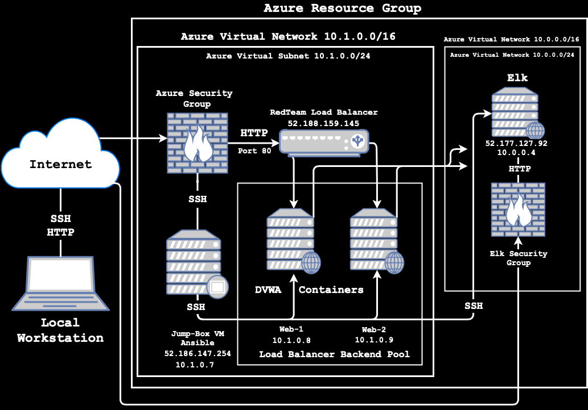
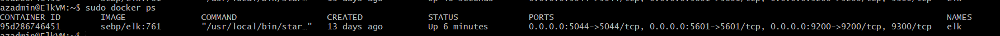
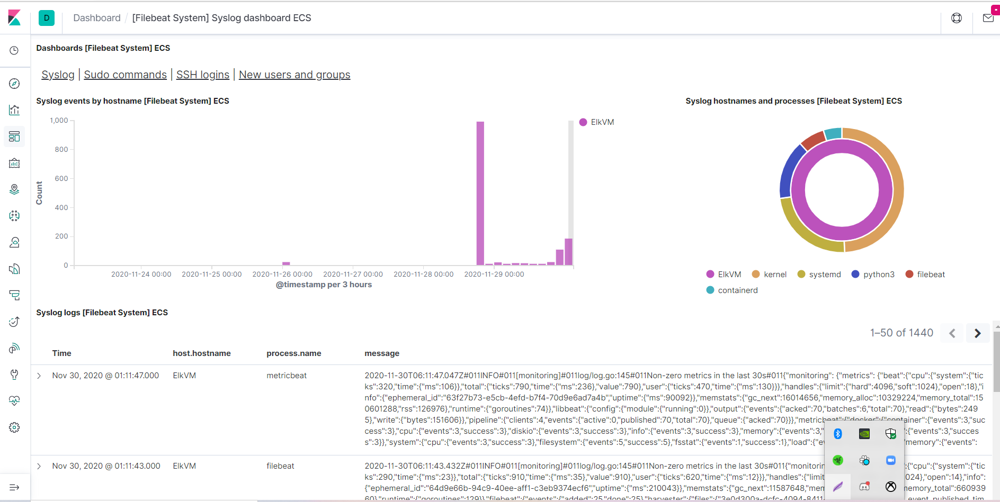
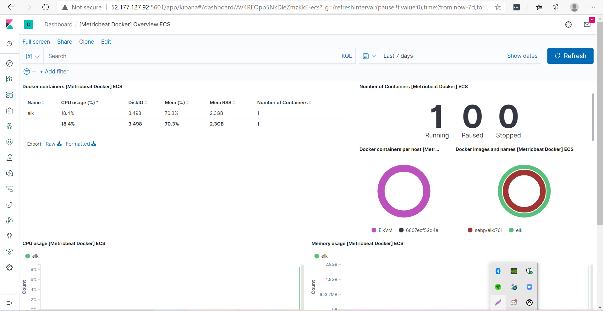

## Automated ELK Stack Deployment

The files in this repository were used to configure the network depicted below.

These files have been tested and used to generate a live ELK deployment on Azure. They can be used to either recreate the entire deployment pictured above. Alternatively, select portions of the playbook file may be used to install only certain pieces of it, such as Filebeat.

---
- name: installing and launching filebeat
  hosts: elk
  become: yes
  tasks:

  - name: download filebeat deb
    command: curl -L -O https://artifacts.elastic.co/downloads/beats/filebeat/filebeat-7.6.1-amd64.deb

  - name: install filebeat deb
    command: dpkg -i filebeat-7.6.1-amd64.deb

  - name: drop in filebeat.yml
    copy:
      src: /etc/ansible/files/filebeat-config.yml
      dest: /etc/filebeat/filebeat.yml

  - name: enable and configure system module
    command: filebeat modules enable system

  - name: setup filebeat
    command: filebeat setup

  - name: start filebeat service
    command: sudo service filebeat start

This document contains the following details:
- Description of the Topologu
- Access Policies
- ELK Configuration
  - Beats in Use
  - Machines Being Monitored
- How to Use the Ansible Build

### Description of the Topology

The main purpose of this network is to expose a load-balanced and monitored instance of DVWA, the D*mn Vulnerable Web Application.

Load balancing ensures that the application will be highly available, in addition to restricting traffic to the network.
- A load balancer protects from a Distributed Denial-of-Service (DDos) 
- What is the advantage of a jump box? A jump box is the main hub of control for other machines and controls access by allowing connections from specific IP addresses, then forwarding those connections to their respective machines

Integrating an ELK server allows users to easily monitor the vulnerable VMs for changes to the logs and system traffic.
- What does Filebeat watch for? Filebeat watches and collects data about the file system.
- What does Metricbeat record? Metricbeat records and collects operating machine metrics.

The configuration details of each machine may be found below.
_Note: Use the [Markdown Table Generator](http://www.tablesgenerator.com/markdown_tables) to add/remove values from the table_.

| Name                 | Function      | IP Address       | Operating System |
|----------------------|---------------|------------------|------------------|
| Jump-Box-Provisioner | Gateway       | 52.186.147.254   | Linux            |
| Web-1                | UbuntuServer  | 10.1.0.8         | Linux            |
| Web-2                | UbuntuServer  | 10.1.0.9         | Linux            |
| ElkVM                | UbuntuServer  | 10.0.0.4         | Linux            |
| RedTeamLB            | Load Balancer | 52.188.159.145   |                  |

### Access Policies

The machines on the internal network are not exposed to the public Internet. 

Only the Jump Box machine can accept connections from the Internet. Access to this machine is only allowed from the following IP addresses:
- 73.30.XXX.XXX/32

Machines within the network can only be accessed by SSH.
- Which machine did you allow to access your ELK VM? Jump-Box-Provisioner
- What was its IP address? 52.186.147.254

A summary of the access policies in place can be found in the table below.

| Name                 | Publicly Accessible | Allowed IP Addresses |
|----------------------|---------------------|----------------------|
| Jump-Box-Provisioner | Yes                 | 73.30.XXX.XXX/32     |
| Web-1                | No                  | 10.1.0.7             |
| Web-2                | No                  | 10.1.0.7             |
| ElkVM                | No                  | 10.1.0.7             |

### Elk Configuration

Ansible was used to automate configuration of the ELK machine. No configuration was performed manually.

- What is the main advantage of automating configuration with Ansible? Automating with Ansible allows you to create consistent, reproducable results throughout multiple machine configurations.

The playbook implements the following tasks:
- Explain the steps of the ELK installation play.
 - Instal docker.io
 - Instal python3.pip
 - Install docker module
 - Increase virtual memory
 - Use more memory
 - Download and lauch a docker elk container through published ports:
   - 5601:5601
   - 9200:9200
   - 5044:5044

The following screenshot displays the result of running `docker ps` after successfully configuring the ELK instance.

### Target Machines & Beats
This ELK server is configured to monitor the following machines:
- Web-1 10.1.0.8
- Web-2 10.1.0.9
- ElkVM 10.0.0.4

We have installed the following Beats on these machines:
- Filebeat
- Metricbeat

These Beats allow us to collect the following information from each machine:
- _TODO: In 1-2 sentences, explain what kind of data each beat collects, and provide 1 example of what you expect to see. E.g., `Winlogbeat` collects Windows logs, which we use to track user logon events, etc._
- Filebeat: monitors the log files or locations that you specify, such as Syslogs, Sudo commands, SSH logins, and New users and groups. This is illustrated by Kibana below:

- Metricbeat: monitors the metrics and statistics of the operating system, such as CPU usage, memory usage, and docker containers. This is demonstrated by Kibana below:

### Using the Playbook
In order to use the playbook, you will need to have an Ansible control node already configured. Assuming you have such a control node provisioned: 

SSH into the control node and follow the steps below:
- Copy the _____ file to _____.
- Update the _____ file to include...
- Run the playbook, and navigate to ____ to check that the installation worked as expected.

_TODO: Answer the following questions to fill in the blanks:_
- _Which file is the playbook? Where do you copy it?_
- _Which file do you update to make Ansible run the playbook on a specific machine? How do I specify which machine to install the ELK server on versus which to install Filebeat on?_
- _Which URL do you navigate to in order to check that the ELK server is running?

_As a **Bonus**, provide the specific commands the user will need to run to download the playbook, update the files, etc._
